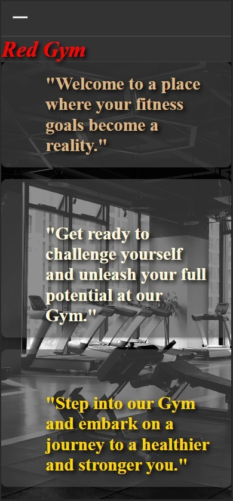
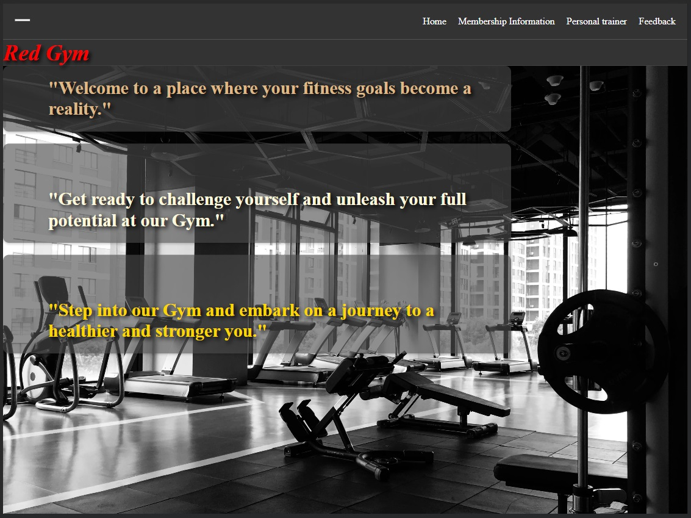
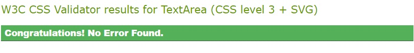

## Gym-Project
 #### First project.Gym website

* This is a Gym README file. 
* this is my first readme. 
*   basic html and css  website.
*   Red Gym

## Table of Contents

#### [User-experience]
 
 * Home Page: Our home page serves as a welcoming page  to our gym.
 * Membership Information
 * Personal Training
 * Feedback
 

#### [Design]
 * Background color always dark and cold (#555)
 * Background image always dark and cold (url(paxels))
 * Titles and paragraphs  adapt to beckground
 * Logo  always left top . color (red)
 * Extra shadow added to text.

#### [Wireframes]
* 
* 
* 

#### [Github repository] 
 *  https://github.com/balazsbarniy/Gym-Project

## [Features]
 * Responsive on all device size
 * Clear navigation
 * Navbar created in top-left corner

#### [Language used]
 * html
 * css

#### [Testing]
 * No errors were found when passing through the official W3C validator
 * 

#### [Media]
 * All images were taken from open source site. - "shutterstock" <https://www.shutterstock.com/>
                                                  - "Unspalsh" https://unsplash.com/backgrounds/apps/website
                                                  - "Pexels" https://www.pexels.com/search/gym/
                              
## [Content]
 * All the content was write by creator (with help of google translate)
 